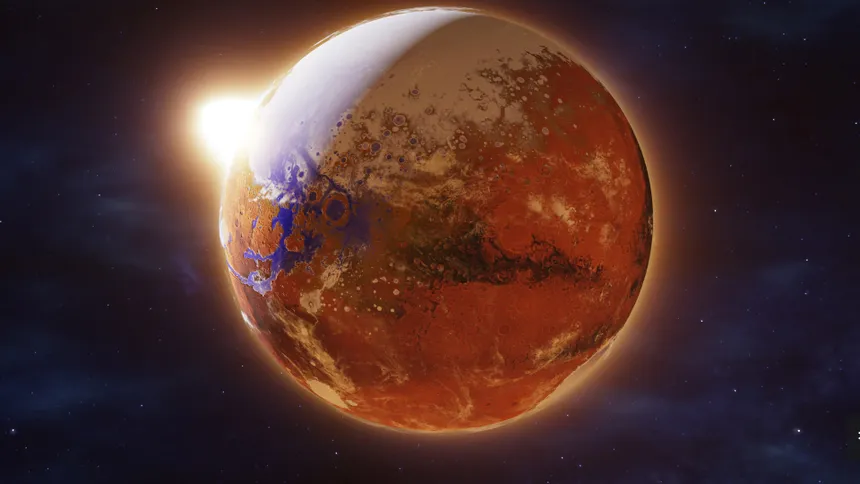

# Red Sand
Red sand game about the colonization and conquest of Mars using economies of scale.

## Vision
Something like this:

## Terrain
Terrain should be detailed and nice while also striving for low poly look. There should be ways of covering background with a blur effect to reduce need to render higher detail on edges of the screen while also not needing many poly count. Something rendered from above can also attempt to approximate this.

A top view maybe can take inspiration from KSP2.

